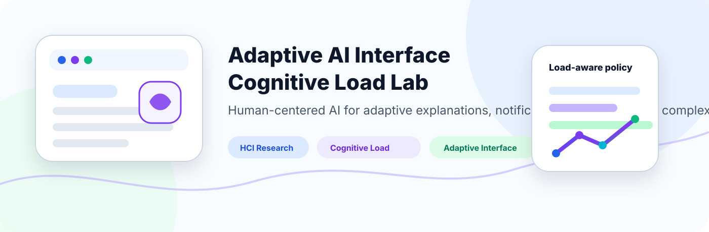
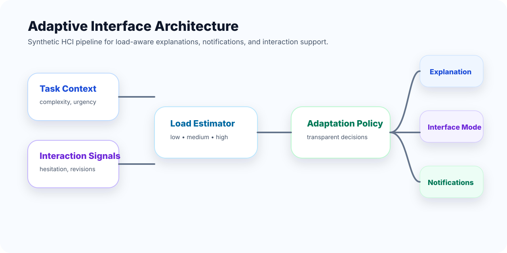
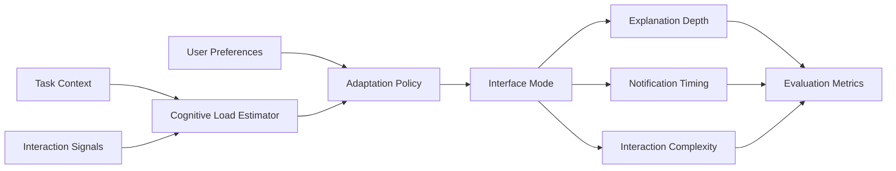
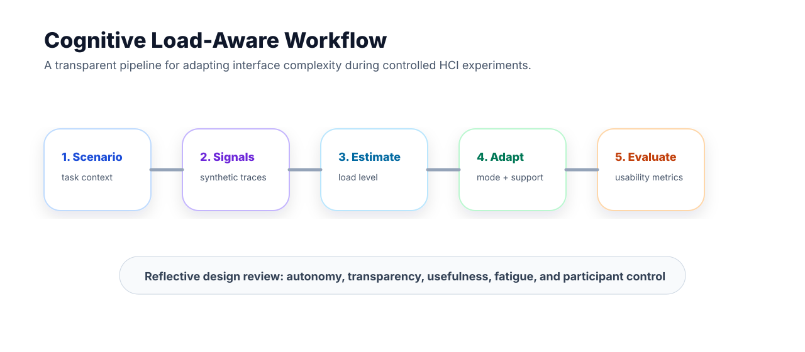
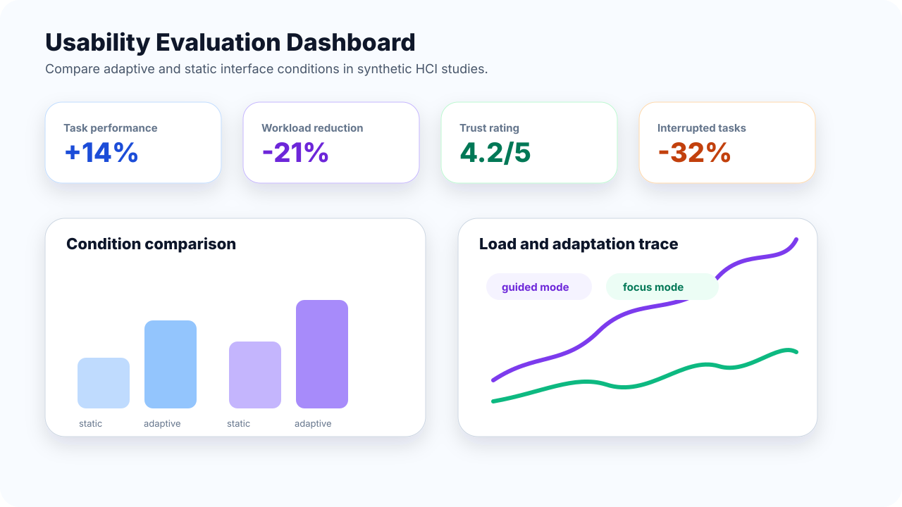

<p align="center">
  
</p>

<h1 align="center">Adaptive AI Interface Cognitive Load Lab</h1>

<p align="center">
  <b>An academic HCI and human-centered AI research prototype for cognitive-load-aware adaptive interfaces.</b>
</p>

<p align="center">
  
  
  
  
  
</p>

---

## Overview

**Adaptive AI Interface Cognitive Load Lab** is an academic Human-Computer Interaction research prototype for studying how AI-supported interfaces can adapt their information density, notification timing, explanation depth, and interaction complexity when users are under different levels of cognitive load.

The project is designed for HCI, human-centered AI, explainable AI, usability evaluation, and responsible adaptive-system research. It does not infer clinical mental states and does not provide a deployment-ready user-monitoring system. Instead, it offers a synthetic and transparent research scaffold for exploring adaptive interface behaviour in controlled experiments.

---

## Research Motivation

Complex digital systems often present users with too much information at the wrong time. Dashboards, decision-support systems, learning platforms, developer tools, and workplace applications can all create overload through excessive notifications, dense explanations, unclear choices, or poorly timed prompts.

This project asks whether adaptive AI interfaces can reduce that overload by adjusting the interface to the task context and observable interaction signals in a transparent and user-controllable way.

---

## Core Research Question

> **Can cognitive-load-aware adaptive interfaces improve task performance, usability, and user trust without reducing user autonomy or transparency?**

---

## Research Objectives

| Objective | Description |
|---|---|
| Cognitive load modelling | Estimate low, medium, or high load from synthetic task and interaction signals. |
| Adaptive interface policy | Select interface modes such as concise, balanced, guided, or focus mode. |
| Explanation adaptation | Adjust explanation depth and detail according to task complexity and user needs. |
| Notification regulation | Reduce interruptions during high-load moments while preserving important information. |
| HCI evaluation | Compare static and adaptive interfaces using performance, usability, trust, and workload measures. |
| Responsible boundary | Keep adaptation transparent, user-controllable, and non-clinical. |

---

## System Architecture

<p align="center">
  
</p>



---

## Cognitive Load Workflow

<p align="center">
  
</p>

| Stage | Research purpose |
|---|---|
| Observe task context | Represent task complexity, urgency, information volume, and error risk. |
| Observe interaction signals | Use synthetic response time, hesitation, revision, and interruption measures. |
| Estimate load | Classify cognitive load into low, medium, or high for controlled experiments. |
| Select adaptation | Choose interface mode, explanation depth, notification level, and support style. |
| Evaluate outcome | Compare performance, workload, trust, and perceived autonomy. |

---

## Evaluation Dashboard Concept

<p align="center">
  
</p>

---

## Example Adaptation Modes

| Mode | Trigger | Interface behaviour |
|---|---|---|
| Concise | Low load and familiar task | Show compact explanations and minimal guidance. |
| Balanced | Medium load or moderate uncertainty | Show essential explanation plus optional details. |
| Guided | High complexity or repeated hesitation | Add step-by-step support and clearer action grouping. |
| Focus | High load and high interruption risk | Delay non-urgent notifications and reduce visual density. |
| Recovery | Recent error or repeated revision | Highlight correction options and explain consequences gently. |

---

## Quick Start

```bash
git clone https://github.com/Hirakhyzer/adaptive-ai-interface-cognitive-load-lab.git
cd adaptive-ai-interface-cognitive-load-lab
python -m venv .venv
source .venv/bin/activate  # Windows: .venv\\Scripts\\activate
python -m pip install --upgrade pip
python -m pip install -e .
python examples/run_adaptation_demo.py
pytest
```

---

## Repository Structure

```text
adaptive-ai-interface-cognitive-load-lab/
├── README.md
├── assets/
│   ├── banner.svg
│   ├── adaptive-interface-architecture.svg
│   ├── cognitive-load-workflow.svg
│   └── usability-evaluation-dashboard.svg
├── data/
│   └── scenario_templates.json
├── docs/
│   ├── research-background.md
│   ├── adaptive-interface-framework.md
│   ├── cognitive-load-signals.md
│   ├── evaluation-methodology.md
│   ├── ethical-boundary.md
│   └── study-protocol.md
├── examples/
│   └── run_adaptation_demo.py
├── src/cognitive_load_interface/
│   ├── schema.py
│   ├── load_estimator.py
│   ├── adaptation_policy.py
│   ├── evaluation.py
│   └── __init__.py
└── tests/
    └── test_adaptation_policy.py
```

---

## Ethical Boundary

This repository is for synthetic HCI research and education. It does not diagnose mental states, monitor real users, collect biometric data, or make workplace surveillance claims. Any participant-facing study would require informed consent, privacy protection, opt-out choices, and institutional ethics review.

---

## Expected Contributions

- A clear HCI framing for cognitive-load-aware adaptive AI interfaces.
- A lightweight synthetic prototype for interface adaptation experiments.
- Research documentation for cognitive load signals, evaluation design, and ethical boundaries.
- A reusable structure for comparing static and adaptive interface conditions.
- Educational material for human-centered AI and adaptive interface design.

---

## License

Released under the [MIT License](LICENSE).

---

## Author

Created by **Hira Khyzer** as an academic HCI and human-centered AI research prototype.

<p align="center">
  <b>Adaptive AI Interface Cognitive Load Lab — designing adaptive interfaces that support people without taking control away from them.</b>
</p>